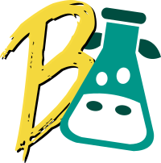

<!--  -->
<!-- Don't render this in actual documentation -->

<!--  -->

# babel-plugin-i18next-extract

[](https://opensource.org/licenses/MIT)
[](https://dev.azure.com/gilbsgilbert/babel-plugin-i18next-extract/_build/latest?definitionId=1&branchName=master)
[](https://app.netlify.com/sites/i18next-extract/deploys)
[](https://codeclimate.com/github/gilbsgilbs/babel-plugin-i18next-extract/test_coverage)

[](https://www.npmjs.com/package/babel-plugin-i18next-extract)

---

babel-plugin-i18next-extract is a [Babel Plugin](https://babeljs.io/docs/en/plugins/) that will
traverse your Javascript/Typescript code in order to find i18next translation keys.

## Features

- ✅ Keys extraction in [JSON v3 format](https://www.i18next.com/misc/json-format).
- ✅ Detection of `i18next.t()` function calls.
- ✅ Full [react-i18next](https://react.i18next.com/) support.
- ✅ Plurals support.
- ✅ Contexts support.
- ✅ Namespace detection.
- ✅ Disable extraction on a specific file sections or lines using [comment hints](
  https://i18next-extract.netlify.com/#/comment-hints?id=disable-extraction-on-a-specific-line-or-code-section).
- ✅ Overwrite namespaces, plurals and contexts on-the-fly using [comment hints](
  https://i18next-extract.netlify.com/#/comment-hints?id=explicitly-specify-contexts-for-a-key).
- [… and more?](https://i18next-extract.netlify.com/#/contributing)

<!--  -->
<!-- Don't render this in actual documentation -->

## Documentation

You can check out the full documentation at [i18next-extract.netlify.com](
https://i18next-extract.netlify.com).

<!--  -->

## Quick Start

### Installation

```bash
yarn add --dev babel-plugin-i18next-extract

# or

npm i --save-dev babel-plugin-i18next-extract
```

### Minimal configuration

> If you don't have a babel configuration yet, you can follow the [Configure Babel](
https://babeljs.io/docs/en/configuration) documentation page to get started.

Declare the plugin like any other plugin in your `.babelrc` and you're good to go:

```javascript
{
  "plugins": [
    "i18next-extract",
    // […] your other plugins […]
  ]
}
```

You may want to specify additional configuration options:

```javascript
{
  "plugins": [
    ["i18next-extract", {"nsSeparator": "~"}],
    // […] your other plugins […]
  ]
}
```

> For an exhaustive list of configuration options, check out the [Configuration](
https://i18next-extract.netlify.com/#/configuration) page.

Once the plugin is setup, you can build your app normally or run Babel through [Babel CLI](
https://babeljs.io/docs/en/babel-cli):

```bash
yarn run babel -f .babelrc 'src/**/*.{js,jsx,ts,tsx}'

# or

npm run babel -f .babelrc 'src/**/*.{js,jsx,ts,tsx}'
```

Extracted translations land in the `extractedTranslations/` directory by default.
